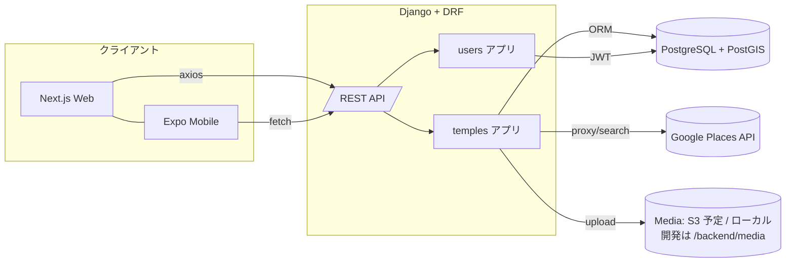
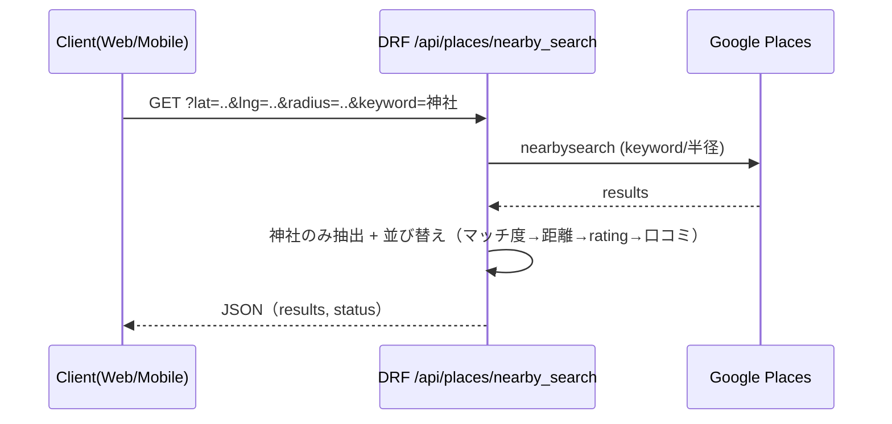
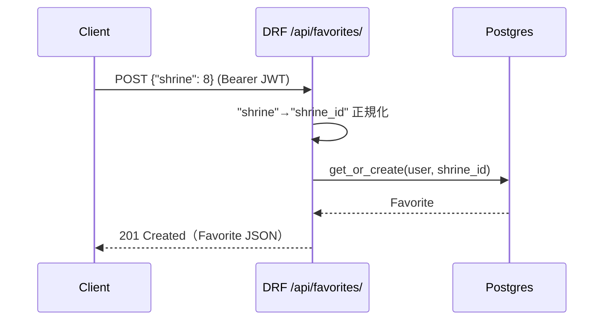

# 🏗️ architecture.md — AI参拝ナビ（神社_app）アーキテクチャ概要

本ドキュメントは、プロジェクト全体構成・主要コンポーネント・API・データモデル・運用観点を簡潔にまとめたものです。  
実装の詳細は各ディレクトリ配下の README / ソースコードを参照してください。

---

## ディレクトリ構成（詳細）
jinja_app/
├── backend/ # Django + DRF（APIサーバー）
│ ├── shrine_project/ # Django 設定ファイル（settings/urls/wsgi等）
│ ├── temples/ # 神社 / 御朱印 / AIナビ / Ranking / Places API
│ ├── users/ # ユーザー認証・プロフィール設定（JWT）
│ ├── media/ # 御朱印画像保存（S3連携予定）
│ └── manage.py # Django 管理コマンド
│
├── apps/
│ ├── web/ # Next.js（Webフロント）
│ │ ├── app/ # App Router ページ
│ │ ├── components/ # ShrineCard / GoshuinCard / MapRoute / UI
│ │ ├── lib/ # APIクライアント（axios）
│ │ ├── styles/ # Tailwind テーマ
│ │ └── public/ # 静的ファイル
│ └── mobile/ # Expo（モバイルアプリ）
│ ├── app/ # Expo Router ページ
│ ├── components/ # モバイル専用UIコンポーネント
│ ├── lib/ # APIクライアント（Webと共通化予定）
│ └── assets/ # 画像/フォント等の静的リソース
│
├── infra/ # インフラ・環境構築
│ ├── docker-compose.yml # ローカル開発用コンテナ定義
│ ├── Dockerfile.web # Django 用 Dockerfile
│ ├── Dockerfile.frontend # Next.js 用 Dockerfile
│ ├── .env.dev # 開発用環境変数
│ └── .env.prod.example # 本番環境用サンプル env
│
├── docs/ # ドキュメント・設計資料
│ ├── architecture.md # （このファイル）
│ ├── api_endpoints.md # API エンドポイント仕様（予定）
│ ├── windows_gdal_setup.md # Windows GIS 開発環境セットアップ（予定）
│ └── todo.md # 開発TODOリスト
│
└── tests/ # E2E / API テスト


# システム全体像

## データフロー図



## バックエンド（Django / DRF）

### 主要コンポーネント

- **認証**: `rest_framework_simplejwt` による JWT（`/api/token/` 系）
- **レート制限**: DRF スロットル（places, concierge などのスコープ）
- **キャッシュ**: Redis があれば RedisCache、無ければ LocMem（Places/Photo 応答など）
- **地理情報処理**: GeoDjango（PostGIS）、PointField・空間インデックス（GIST）
- **メディア**: `/media/`（本番は S3 連携予定）

### 代表的なAPI（抜粋）

| Path | Method | Auth | 概要 |
|------|--------|------|------|
| `/api/shrines/` | GET | 任意 | 神社一覧（簡易情報） |
| `/api/favorites/` | GET/POST/DELETE | JWT | お気に入りの取得/追加/削除（shrine 別名受付 → shrine_id 正規化） |
| `/api/route/` | POST | 任意 | ルートMVP（ハバースイン距離→所要時間推計） |
| `/api/places/search/` | GET | 任意 | テキスト検索（神社バイアス） |
| `/api/places/text_search/` | GET | 任意 | テキスト検索（pagetoken 対応） |
| `/api/places/nearby_search/` | GET | 任意 | 周辺検索（lat,lng,radius 必須） |
| `/api/places/find_place/` | GET | 任意 | Find Place（locationbias 対応） |
| `/api/places/photo/` | GET | 任意 | Place Photo 透過（キャッシュ付） |
| `/api/places/{place_id}/` | GET | 任意 | Place 詳細の最小情報 |

> **注記**: 詳細は `docs/api_endpoints.md`（予定）で体系化。

## データモデル（抜粋）

### 主要モデル

- **PlaceRef**: Google place_id のローカル参照（名称/住所/座標/スナップショットJSON、同期待ち）
- **GoriyakuTag**: ご利益タグ（カテゴリ：ご利益/神格/地域）
- **Shrine**: 神社（名称・住所・latitude/longitude・location(Point)・ご利益/祭神・人気指標）
- **Favorite**: お気に入り（user × shrine または place_id、XOR 制約＋ユニーク）
- **Visit**: 参拝履歴（任意）
- **Goshuin**: 御朱印（画像1–3、公開可否、いいね等）
- **ViewLike**: 閲覧/いいね（将来の集計用ログ）
- **RankingLog**: ランキング集計（日次）
- **ConciergeHistory**: AI 推薦履歴（理由/タグ）

### データベース設計

- **PostGIS**: `Shrine.location` に GIST/GEOGRAPHY インデックス（周辺検索/距離計算に活用）

## 設定ポイント

### 基本設定
- `LANGUAGE_CODE="ja"`
- `TIME_ZONE="Asia/Tokyo"`
- DB 接続は `.env` 優先（Docker 内/外を `pick_db_host()` で吸収）

### API制限・キャッシュ設定
- **スロットル**: places, places_burst, places_sustain, concierge 等
- **既定の検索バイアス**: 
  - `PLACES_TEXT_DEFAULT_LOCATION`
  - `PLACES_TEXT_DEFAULT_RADIUS_M`

## フロントエンド

### Web（Next.js / App Router）

- **API クライアント**: `apps/web/lib/api.ts` に集約（axios）
- **機能**: 
  - 検索・神社カード・お気に入りトグル（実装中）
  - ルート表示（実装予定）
- **UI**: Tailwind + shadcn/ui（モバイルファースト）

### Mobile（Expo）

- **API**: Web と共有方針（`EXPO_PUBLIC_API_BASE`）
- **機能予定**: 
  - 近隣神社（expo-location）
  - 御朱印投稿（expo-image-picker）

## 代表的なシーケンス例

### 1) 周辺検索（Nearby）



### 2) お気に入り登録



## 環境変数（例・抜粋）

```bash
# データベース
DJANGO_DB_HOST=127.0.0.1
DJANGO_DB_PORT=5432
DJANGO_DB_NAME=jinja_db
DJANGO_DB_USER=admin
DJANGO_DB_PASSWORD=******

# 認証
DJANGO_SECRET_KEY=dev-secret
# SIMPLE_JWT は settings 既定、必要に応じて上書き

# Places API
PLACES_TEXT_DEFAULT_LOCATION=35.71,139.80
PLACES_TEXT_DEFAULT_RADIUS_M=3000

# キャッシュ (Redisがある場合)
REDIS_URL=redis://localhost:6379/0

# AI機能（AIコンシェルジュで使用予定）
OPENAI_API_KEY=sk-...
```

## 非機能要件の要点

### 性能
- Places系は結果をキャッシュ（Text/Find/Photo）
- 並び替えは「マッチ度→距離→Rating→口コミ数」

### 可用性
- Google上流失敗時は 502 を明示返却（detail に上流エラー）

### セキュリティ
- JWT 認証
- CORS 設定（localhost:3000 を許可）
- 画像アップロードは本番で S3 へ

### 運用
- Popular/Raking 集計は30日指標（バッチ導入予定）
- マイグレーションは PostGIS 有効化と空間Index付与

## 今後の追加予定

- [ ] `docs/api_endpoints.md` に API 仕様を体系化（認可/スロットル/例含む）
- [ ] `docs/windows_gdal_setup.md` に Windows GIS 開発手順
- [ ] 本ドキュメントにアーキテクチャ図（C4/時系列/ER 図）の拡充